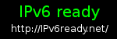

# IPv6-ready

Können Sie IPv6? Diese Frage lässt sich mit Hilfe von [IPv6 ready?](https://www.ipv6ready.de/) beantworten.
Die Seite bietet auch Bilder an, die in die eigene Webseite eingebettet werden können.
Im Zuge der Datenschutz-Grundverordnung (DSGVO) fragt sich nun mancher Website Betreiber, ob er die Logos überhaupt noch einbinden darf.
Um dieser Frage aus dem Weg zu gehen gibt es nun zum Anzeigen der Logos einfache PHP-Dateien, die in die eigene Webseite integriert werden können.

## ipv6readyornot.php

Diese Datei liefert die neue Logo Version aus.

Ein Einbindung erfolgt einfach als Bild mit oder ohne Link zur erklärenden Webseite:

    <!-- Einbindung mit Link zur IPv6 ready Webseite. -->
    
    <!-- Einbindung ohne Link zur IPv6 ready Webseite. -->
    

## readyornot.php 

Diese Datei liefert die alte Logo Version aus.

Ein Einbindung erfolgt einfach als Bild mit oder ohne Link zur erklärenden Webseite:

    <!-- Einbindung mit Link zur IPv6 ready Webseite. -->
    
    <!-- Einbindung ohne Link zur IPv6 ready Webseite. -->
    

## Die PHP Dateien aus den Bildern neu generieren

    ./create.sh > readyornot.php
 
    ./create2.sh > ipv6readyornot.php
